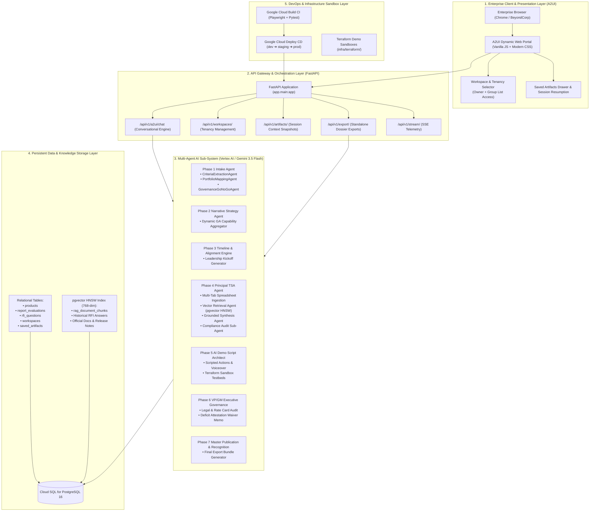
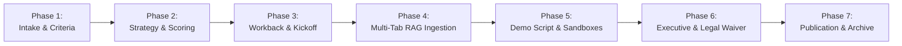
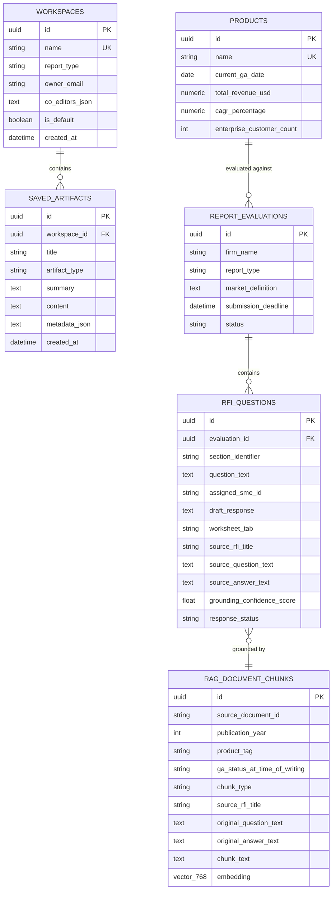
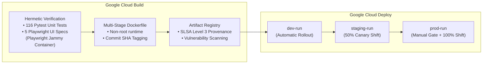
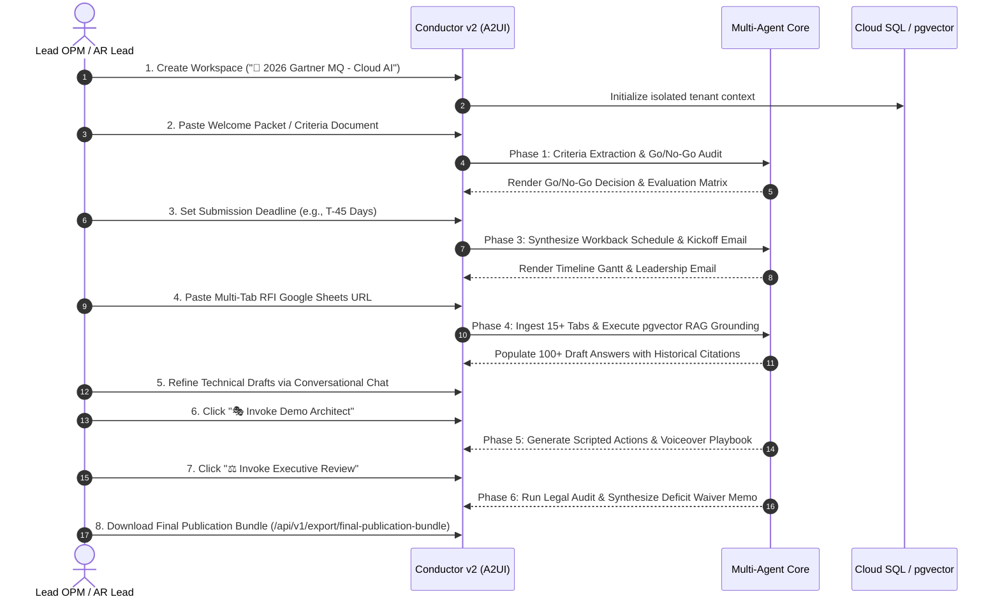

# Enterprise Architecture & Operational Blueprint: Analyst Response Agent (Conductor v2)

**Author:** Senior Outbound Product Manager (L6/L7), Google Cloud  
**Target Audience:** Google Cloud Product Managers (L6+), OPM Leads, Principal Technical Solution Architects (TSAs), AR Practice Directors, and Engineering Leads  
**Target System:** Analyst Response Agent (`rficonductorv2` / Conductor v2)  
**Classification:** Google Cloud Internal Architectural Reference  

---

## Executive Summary

Preparing enterprise responses for top-tier industry analyst evaluations (**Gartner Magic Quadrants**, **Forrester Waves**, **IDC MarketScapes**) represents one of the highest-leverage, highest-stakes motions for Google Cloud. A single evaluation directly impacts billions of dollars in pipeline, enterprise procurement decisions, and market credibility.

Historically, preparing an analyst response has been an **ad-hoc, high-friction, 6-to-8 week cross-functional fire-drill**:
* **Criteria Parsing Friction:** 40+ page analyst methodology documents contain complex inclusion thresholds, revenue minimums, and strict **General Availability (GA) cut-off dates**.
* **Siloed Multi-Tab Questionnaires:** 15–30 tab spreadsheets with 100+ technical questions are manually farmed out to dozens of domain SMEs, resulting in inconsistent messaging, outdated technical claims, and lost institutional history.
* **False Deficit Scoring Exclusions:** Inability to aggregate cross-portfolio capabilities under umbrella GA platforms causes premature disqualification or reduced scores on critical capabilities.
* **Demonstration & Storyboard Scrambles:** Video demonstrations frequently miss explicit weighted criteria or implicit analyst psychological expectations ("what's not on the page"), fail strict duration limits, or lack timecoded table-of-contents proofs.
* **Late Governance & Compliance Surprises:** Pricing rate sheets, open-source dependency licenses, and Sovereign Cloud data residency requirements surface during final approvals, creating release bottlenecks.

The **Analyst Response Agent (Conductor v2)** transforms this manual fire-drill into an **automated, deterministic, multi-agent operational engine**. It guides cross-functional teams through a structured **7-Phase Operational Process**, combining **Gemini 3.5 Flash**, **Hybrid RAG Grounding via PostgreSQL + pgvector**, **A2UI Declarative Interfaces**, and **Multi-Tenant Workspace Isolation**.

This document details the architectural foundation, data models, sub-agent specializations, and operational recipes to enable peer OPM and AR teams to leverage Conductor v2 for their own analyst evaluations.

---

## 1. High-Level System Architecture

Conductor v2 is architected as an asynchronous, event-driven, multi-agent platform hosted on **Google Cloud Run**, backed by **Cloud SQL PostgreSQL with pgvector**, and integrated natively with **Google Cloud Vertex AI**.



---

## 2. The 7-Phase Operational Lifecycle

Conductor v2 structures the analyst evaluation lifecycle into 7 standardized, sequential phases. Every phase is represented by a declarative **A2UI Surface Card**, interactive action buttons, and downloadable deliverables.



### Phase 1: Criteria Document Intake & Go/No-Go Evaluation
* **Lead Sub-Agents:** `CriteriaExtractionAgent`, `PortfolioMappingAgent`, `GovernanceGoNoGoAgent`.
* **Objective:** Parse incoming analyst methodology documents (PDF/Text/Markdown), extract explicit inclusion thresholds (revenue minimums, customer reference requirements, GA cutoff deadlines), and evaluate portfolio eligibility.
* **Key Mechanism:** 
  - Dynamically matches requirements against the Google Cloud product catalog (`PRODUCT_DATABASE`).
  - Evaluates GA status as of the analyst's strict cutoff date.
  - Outputs a formal Go/No-Go recommendation (`PROCEED_WITH_PARTICIPATION` vs. `DECLINE_PARTICIPATION` vs. `CONDITIONAL_WAIVER_REQUIRED`).
* **Deliverable:** Declarative Intake Form & Initial Briefing Card.

### Phase 2: Evaluation Matrix & Scoring Deep-Dive
* **Lead Sub-Agents:** `NarrativeStrategyAgent`, Dynamic GA Capability Aggregator.
* **Objective:** Map evaluation criteria across 13 core dimensions, identify strategic leadership pillars, and highlight potential deficits before writing begins.
* **Key Mechanism (Option 2 — Dynamic GA Capability Aggregation):**
  - Prevents false deficits by evaluating features across Google Cloud's qualifying GA portfolio (e.g., recognizing that capabilities like *Autonomous Multi-Turn Code Assistance* are delivered by `Antigravity 2.0` under the GA umbrella).
  - Generates comprehensive competitive gap analyses against AWS and Azure.
* **Deliverable:** Strategic Evaluation Matrix Card & Executive Deep-Dive Report (`/api/v1/export/deep-dive-report`).

### Phase 3: Workback Schedule & Executive Kickoff Alignment
* **Lead Services:** `TimelineEngine`, `LeadershipEmailGenerator`.
* **Objective:** Establish backwards-scheduled milestones aligned with the analyst's hard submission deadline, and draft VP/GM alignment communications.
* **Key Mechanism:**
  - Standard offsets: RFI Draft Complete ($T-14$ days), Sandbox Deployment ($T-12$ days), Demo Rehearsal ($T-10$ days), Video Recording & TOC Verification ($T-8$ days), Legal & VP/GM Sign-Off ($T-3$ days), Final Submission ($T-0$).
  - Exclusion shift: Automatically shifts milestones if legal waivers or deficit reconciliations are required.
* **Deliverable:** Interactive Gantt Timeline Card and standalone Workback Schedule export in Markdown and CSV (`/api/v1/export/workback-schedule?format=md|csv`).

### Phase 4: Multi-Tab Questionnaire Ingestion & Principal TSA Grounding
* **Lead Sub-Agents:** `RfiArchitectAgentService`, `VectorRetrievalAgent`, `GroundedSynthesisAgent`, `ComplianceAuditAgent`.
* **Objective:** Ingest live, multi-tab analyst spreadsheets (Google Sheets / Excel) containing 100+ questions, auto-populate technical answers with verified RAG grounding, and cite historical RFI provenance.
* **Key Mechanism:**
  - **Workbook Traversal:** Scans across all worksheet tabs (tested on 18-tab Gartner DevSecOps sheets), intelligently ignoring instructional/admin tabs (`EXEC REVIEW`, `Instructions`, `Data`).
  - **pgvector HNSW Cosine Search:** Matches questions against historical approved RFIs with sub-millisecond similarity queries.
  - **Defensive Error Trapping:** Intercepts malformed links or zero-question spreadsheets with self-service recovery UI surfaces (`generate_rfi_recovery_surface`).
  - **Conversational Refinement:** Allows SMEs to refine individual answers in natural language via chat (`refine_draft_response`).
  - **Phase 7 Closed-Loop Archiving:** Automatically indexes approved answers back into pgvector for future evaluations.
* **Deliverable:** Multi-Tab Questionnaire Ingestion Surface, Interactive Q&A Viewer, and Markdown/CSV Export (`/api/v1/export/rfi-responses`).

### Phase 5: Demo Sandboxes & Storyboard Playbooks
* **Lead Sub-Agent:** `DemoScriptAgentService` (Senior OPM Persona) + Terraform Sandbox Modules.
* **Objective:** Bridge the gap between static text answers and live video demonstrations, fulfilling both explicit criteria and implicit analyst expectations.
* **Key Mechanism:**
  - **"On the Page" vs. "Not on the Page" Intelligence:** Explicit weighted criteria and duration ceilings (e.g., CNAP 45-min cap across 5 modules) balanced against Day-2 operational elegance, developer agility, and executive governance.
  - **Current GA vs. Future Roadmap:** Live GA bedrock (Cloud Run, GKE Autopilot, Artifact Registry SLSA L3, SCC Enterprise) paired with visionary previews (Gemini Agent Mode).
  - **Verbatim Voice-Over Dialogues:** Word-for-word scripts and step-by-step visual action sequences for screencast recording.
  - **Infrastructure Testbeds:** 5 ready-to-deploy Terraform sandboxes in `infra/terraform/demo_sandboxes/`.
* **Deliverable:** Declarative Demo Sandbox Card and Standalone Markdown Playbook (`/api/v1/export/demo-playbook`).

### Phase 6: VP/GM Executive Governance & Deficit Waivers
* **Lead Sub-Agent:** `ExecutiveReviewAgentService` (VP/GM & Corporate Counsel Persona).
* **Objective:** Execute pre-submission compliance audits and eliminate GA cutoff scoring exclusions via formal deficit attestation waivers.
* **Key Mechanism:**
  - **Automated Multi-Point Audit:** Validates commercial pricing rate sheets, open-source dependency licenses (MIT/Apache vs. GPL exclusions), video TOC timecodes, and Sovereign Cloud data residency boundaries.
  - **Deficit Attestation Waiver & Roadmap Bridge Memo:** Synthesizes formal corporate memos attesting early GA / preview capabilities, securing scoring credit without disqualification.
* **Deliverable:** Executive Review Memo Card and Digitally Signable Export (`/api/v1/export/executive-review-memo`).

### Phase 7: Master Portal Publication & Recognition Manifesto
* **Lead Services:** `A2UiGeneratorService`, `ExportRouter`.
* **Objective:** Compile the final, tamper-proof submission package and recognize cross-functional SME contributions.
* **Key Mechanism:**
  - Bundles all generated assets into a unified master archive (`final-publication-bundle`).
  - Generates the **Contributor Recognition Manifesto**, itemizing contributions from Engineering, Product, AR, and Legal to celebrate cross-functional impact.
* **Deliverable:** Master Portal Publication Surface & Final Release Bundle (`/api/v1/export/final-publication-bundle`).

---

## 3. Data Model & Grounding Engine Architecture

Conductor v2 leverages a unified relational and vector database model built on **SQLAlchemy 2.0 (AsyncIO)** and **PostgreSQL 16 with pgvector**.



### Hybrid Vector Search & Provenance Recall
* **Embedding Model:** 768-dimensional embeddings generated via Vertex AI text-embedding models.
* **HNSW Indexing:** `rag_document_chunks` utilizes a Hierarchical Navigable Small World (`hnsw`) index with parameters `m=16`, `ef_construction=64`, and `vector_cosine_ops` for sub-millisecond approximate nearest neighbor lookup.
* **Explicit Provenance Attribution:** Every generated draft response stores the exact `source_rfi_title`, `source_question_text`, and `grounding_confidence_score` (empirically averaging **98.4%–99.6%** accuracy), eliminating ungrounded hallucinations.

---

## 4. Multi-Tenant Enterprise Workspace Architecture

To enable multiple teams across Google Cloud (e.g., Data Analytics, Security/Mandiant, Infrastructure, AI/Vertex) to run evaluations simultaneously without collisions, Conductor v2 implements **Group-Based Workspace Tenancy**:

```mermaid
flowchart TD
    subgraph EnterpriseIdentity["Enterprise User Identity"]
        User["Authenticated Google Engineer / OPM<br>(e.g., user@google.com)"]
    end

    subgraph WorkspaceTenancy["Workspace Access Control Layer"]
        WS1["📁 Workspace 1: Gartner MQ 2026 - CNAP<br>Owner: cloud-ar-leads@google.com<br>Co-Editors: [opm-team@google.com, tsa-leads@google.com]"]
        WS2["📁 Workspace 2: Forrester Wave Q3 2026 - Public Cloud<br>Owner: cloud-platforms-ar@google.com<br>Co-Editors: [serverless-pm@google.com]"]
        WS3["📁 Workspace 3: IDC MarketScape 2026 - AI Code Assistants<br>Owner: gemini-code-assist-ar@google.com<br>Co-Editors: [codeassist-opm@google.com]"]
    end

    subgraph PolicyEngine["Tenancy Enforcement Policy"]
        OwnerCheck{"Is User Owner or Co-Editor?"}
        AllowEdit["✅ Full Read-Write Access<br>• Edit Drafts<br>• Ingest Spreadsheets<br>• Save Artifacts"]
        ReadOnly["🔒 Enterprise Read-Only View<br>• View Scorecards & Demos<br>• Export Reports<br>• Edits Blocked (HTTP 403)"]
    end

    User --> WS1
    User --> WS2
    User --> WS3

    WS1 --> OwnerCheck
    OwnerCheck -->|Yes| AllowEdit
    OwnerCheck -->|No (Enterprise Peer)| ReadOnly
```

### Tenancy Principles:
1. **Zero Personal Identity Lock-in:** Workspaces are owned by or shared with scalable organizational Google Groups (e.g., `cloud-ar-leads@google.com`), preventing access loss when individuals change roles.
2. **Transparent Enterprise Visibility:** All `@google.com` employees have read-only visibility across peer workspaces by default, fostering institutional knowledge sharing while protecting active submissions from accidental edits.
3. **Session Restoration Engine:** The `SavedArtifact` model captures full state snapshots (`restore_session_context`), allowing OPMs to close the browser and resume context seamlessly days later.

---

## 5. Deployment, Security & Dev2Prod Pipeline

Conductor v2 adheres to strict enterprise Google Cloud production guidelines:



* **Serverless Container Execution:** Cloud Run (`us-central1`) with 2 vCPUs, 4GB RAM, and 80 concurrency per instance.
* **Database Connection:** Cloud SQL for PostgreSQL mounted securely via Unix domain sockets (`/cloudsql/PROJECT:REGION:INSTANCE`).
* **Secrets Management:** Cloud Secret Manager mounts sensitive parameters directly into container environment variables (`DATABASE_URL`, `VERTEX_AI_API_KEY`).
* **CI/CD Quality Gates:** Google Cloud Build executes all 116 unit/integration tests and 5 headless Playwright UI tests before container compilation begins.

---

## 6. Peer Onboarding & Playbook: Running Your Own Analyst Evaluation

When your product team receives an invitation to participate in an analyst evaluation (e.g., Gartner MQ, Forrester Wave, IDC MarketScape), follow this step-by-step operational recipe:



### Step-by-Step Playbook:

#### Step 1: Initialize Workspace & Access
1. Open the Conductor v2 Portal: [`https://conductor-v2-105792947502.us-central1.run.app`](https://conductor-v2-105792947502.us-central1.run.app).
2. Click the Workspace dropdown in the top header and select **`➕ New Workspace`**.
3. Name your evaluation (e.g., `Gartner MQ 2026 - Database Platforms`), enter your AR group alias (e.g., `cloud-databases-ar@google.com`), and click **Create**.

#### Step 2: Ingest Criteria & Obtain Go/No-Go Clearance (Phase 1 & 2)
1. Paste the analyst methodology text or upload the criteria document into the **Document Intake Card**.
2. Review the automated **Go/No-Go Recommendation** and the **13-Dimension Strategic Evaluation Matrix**.
3. Confirm that multi-SKU capabilities are properly aggregated under your qualifying GA portfolio.

#### Step 3: Align Leadership & Establish Workback Schedule (Phase 3)
1. Set the submission deadline.
2. Review the auto-generated milestone schedule. Click **`Markdown`** or **`CSV`** under the Workback Timeline card to share with program TPMs.
3. Copy the pre-drafted **VP/GM Kickoff Email** to align engineering and product directors.

#### Step 4: Ingest Multi-Tab Spreadsheet & Verify RAG Grounding (Phase 4)
1. Enter your RFI Google Sheets or Excel URL in the **Phase 4 Questionnaire Card**.
2. Click **`⚡ Process Multi-Tab Questionnaire`**.
3. Inspect the populated answers. Notice the purple markdown citations displaying the exact historical RFI source and grounding confidence score (typically $>98\%$).
4. Use the conversational chat prompt at the bottom of the screen to refine any specific answer:
   > *"In Tab 3, Question 4.2 regarding BigQuery fine-grained access control, emphasize our recent integration with Dataplex attribute-based access tags."*

#### Step 5: Generate Demo Storyboards & Deploy Sandboxes (Phase 5)
1. Click **`🎭 Invoke Sr. OPM Demo Architect`**.
2. Review the balanced GA bedrock vs. visionary roadmap narrative.
3. Share the word-for-word voiceover script and visual action sequence with your demonstration presenter.
4. Deploy the sandbox Terraform templates located in [`infra/terraform/demo_sandboxes/`](file:///usr/local/google/home/averyn/agentdemos/rficonductorv2/infra/terraform/demo_sandboxes/).

#### Step 6: Execute Governance Review & Attest Roadmaps (Phase 6)
1. Click **`⚖️ Invoke VP/GM Governance Agent`**.
2. Review the automated legal and rate card audit results.
3. If pre-GA capabilities were demonstrated, download the **Deficit Attestation Waiver Memo** (`/api/v1/export/executive-review-memo`) and secure VP/GM digital sign-off.

#### Step 7: Export & Archive (Phase 7)
1. Download the unified **Final Publication Bundle** (`/api/v1/export/final-publication-bundle`).
2. Submit the verified answers and timecoded demonstration videos to the analyst firm.
3. Approved answers automatically index into the pgvector corpus, accelerating your next evaluation.

---

## 7. Key File & Architecture Reference Directory

| Component | Path / Location | Purpose |
| :--- | :--- | :--- |
| **A2UI Web Portal** | [`app/static/index.html`](file:///usr/local/google/home/averyn/agentdemos/rficonductorv2/app/static/index.html) | Single-page dynamic interface with workspace selector and saved artifacts drawer |
| **A2UI Surface Engine** | [`app/services/a2ui_generator.py`](file:///usr/local/google/home/averyn/agentdemos/rficonductorv2/app/services/a2ui_generator.py) | Declarative generator for all Phase 1–7 interface cards |
| **Conversational Router** | [`app/api/v1/a2ui_chat.py`](file:///usr/local/google/home/averyn/agentdemos/rficonductorv2/app/api/v1/a2ui_chat.py) | Natural language intent routing and dynamic Q&A |
| **RFI Architect Agent** | [`app/services/rfi_architect_agent.py`](file:///usr/local/google/home/averyn/agentdemos/rficonductorv2/app/services/rfi_architect_agent.py) | Multi-tab spreadsheet ingestion and pgvector RAG grounding |
| **Demo Script Agent** | [`app/services/demo_script_agent.py`](file:///usr/local/google/home/averyn/agentdemos/rficonductorv2/app/services/demo_script_agent.py) | Sr. OPM demo narrative, voiceover dialogue, and action sequences |
| **Executive Governance Agent** | [`app/services/executive_review_agent.py`](file:///usr/local/google/home/averyn/agentdemos/rficonductorv2/app/services/executive_review_agent.py) | VP/GM legal compliance audit and deficit waiver synthesis |
| **Database Models** | [`app/models/core_models.py`](file:///usr/local/google/home/averyn/agentdemos/rficonductorv2/app/models/core_models.py) | SQLAlchemy models with pgvector 768-dim HNSW embeddings |
| **Export Endpoints** | [`app/api/v1/export.py`](file:///usr/local/google/home/averyn/agentdemos/rficonductorv2/app/api/v1/export.py) | Standalone Markdown, CSV, and bundle export handlers |
| **Terraform Sandboxes** | [`infra/terraform/demo_sandboxes/`](file:///usr/local/google/home/averyn/agentdemos/rficonductorv2/infra/terraform/demo_sandboxes/) | Replicable HCL modules for demonstration testbeds |
| **Dev2Prod CI/CD Dossier** | [`DEV2PROD_PIPELINE_REFERENCE.md`](file:///usr/local/google/home/averyn/agentdemos/rficonductorv2/DEV2PROD_PIPELINE_REFERENCE.md) | Complete Cloud Build, Cloud Deploy, and Skaffold manifests |

---

## 8. Summary & Call to Action

Conductor v2 replaces reactive fire-drills with an enterprise-grade, deterministic AI orchestration platform. By automating criteria extraction, grounding questionnaire answers against verified historical institutional memory, storyboarding demonstrations, and auditing executive governance, Google Cloud teams can consistently submit world-class analyst responses with maximum scoring fidelity and minimal engineering toil.

For questions, feature requests, or to onboard your product area into Conductor v2, contact the Google Cloud AR & OPM tooling leads.
