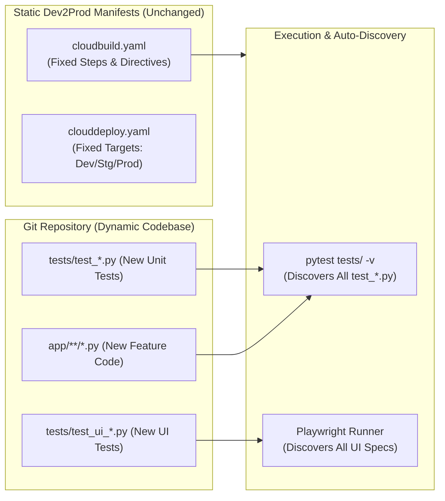
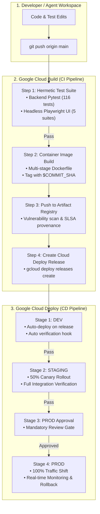

# Google Cloud Dev2Prod CI/CD Pipeline Tooling — Conversation & Architectural Record

**Document Purpose:** Permanent reference and retrospective capturing the discussion, design decisions, Q&A, and technical implementation details regarding Google Cloud Dev2Prod CI/CD pipeline tooling for `rficonductorv2` (Conductor v2 / Analyst Response Agent).

**Reference Sessions:**
- Original Discussion: [Conversation `74130137-cf42-47c8-939b-5b258d0177a5`](conversation://74130137-cf42-47c8-939b-5b258d0177a5)
- Follow-up & Verification: [Conversation `940100fe-9d68-4011-b973-42177a13b245`](conversation://940100fe-9d68-4011-b973-42177a13b245)
- Full Manifest Reference Dossier: [`DEV2PROD_PIPELINE_REFERENCE.md`](file:///usr/local/google/home/averyn/agentdemos/rficonductorv2/DEV2PROD_PIPELINE_REFERENCE.md)

---

## 📑 Table of Contents
1. [Executive Summary & Background](#-1-executive-summary--background)
2. [Conversation Dialogue & Key Questions Answered](#-2-conversation-dialogue--key-questions-answered)
   - [Q1: Review of Past Cloud Run Deployments & Dev2Prod Meshing](#q1-review-of-past-cloud-run-deployments--dev2prod-meshing)
   - [Q2: Static Pipeline Architecture vs. Dynamic Test Code Generation](#q2-static-pipeline-architecture-vs-dynamic-test-code-generation)
   - [Q3: UI Testing & Headless Playwright Discovery in Cloud Build](#q3-ui-testing--headless-playwright-discovery-in-cloud-build)
   - [Q4: Implementation & Manifest Verification](#q4-implementation--manifest-verification)
3. [Component-by-Component Comparison: What Works As-Is vs. What Requires Updating](#-3-component-by-component-comparison-what-works-as-is-vs-what-requires-updating)
4. [Dev2Prod Architecture & Delivery Flow](#-4-dev2prod-architecture--delivery-flow)
5. [Testing Strategy: Dynamic Scaling & Hermetic Verification](#-5-testing-strategy-dynamic-scaling--hermetic-verification)
6. [Complete Manifest Inventory](#-6-complete-manifest-inventory)
7. [Operational Commands & Quick-Reference Guide](#-7-operational-commands--quick-reference-guide)

---

## 📌 1. Executive Summary & Background

During development of the **Analyst Response Agent** (`rficonductorv2`), feature rollouts and cloud deployments were historically executed via custom automation scripts (e.g., [`infra/deploy_cloud_run.sh`](file:///usr/local/google/home/averyn/agentdemos/rficonductorv2/infra/deploy_cloud_run.sh)). 

To transition from ad-hoc deployments to an enterprise-grade **Google Cloud Dev2Prod** workflow, we evaluated how these manual steps translate into native Google Cloud DevOps services:
* **Google Cloud Build (CI):** Hermetic testing, container building, vulnerability scanning, and release generation.
* **Google Artifact Registry:** Immutable container storage with SLSA Level 3 provenance and vulnerability scanning.
* **Google Cloud Deploy (CD):** Declarative, progressive multi-target delivery pipelines (`dev` ➔ `staging` ➔ `prod`).
* **Skaffold (v2beta28):** Unified build and deploy abstraction for Google Cloud Run services.
* **Playwright + Pytest:** Automated UI browser verification alongside backend test discovery.

---

## 💬 2. Conversation Dialogue & Key Questions Answered

### Q1: Review of Past Cloud Run Deployments & Dev2Prod Meshing

> **User Prompt:**  
> *"Review the last few times I updated and deployed feature updates to cloud run. List the steps most commonly used. Could the steps listed mesh with a traditional CI/CD pipeline made up of Google Cloud Dev2Prod apps? Which would work as-is? Which would require updating?"*

#### Historical Deployment Steps Observed:
1. **Local Test Execution:** Running `pytest` locally inside `.venv` (`.venv/bin/pytest tests/ -v`).
2. **Container Image Build:** Invoking `gcloud builds submit --tag gcr.io/...` or direct Docker builds.
3. **Cloud Run Service Update:** Running `gcloud run deploy conductor-v2 --image ... --region us-central1` with inline environment variables and Cloud SQL volume mounts.
4. **Post-Deployment Smoke Testing:** Running Python verification scripts (e.g., `test_live_cloud_run_portal.py`, `run_visual_resilience_verification.py`).

#### Analysis of Fit with Google Cloud Dev2Prod:
* **Yes, they mesh cleanly:** The ad-hoc workflow maps 1:1 to Google Cloud Build and Google Cloud Deploy primitives.
* **Separation of Concerns:** Instead of a single monolithic script deploying directly to production, the process is split into **CI (Build & Test)** and **CD (Multi-Stage Progressive Promotion)**.

---

### Q2: Static Pipeline Architecture vs. Dynamic Test Code Generation

> **User Prompt:**  
> *"When new code is generated, the tests are updated to account for the new functionality, correct? How does this static pipeline account for the new tests needed to support future code changes?"*

#### The Architectural Solution:
Modern CI/CD pipelines use **static, declarative pipeline manifests** (`cloudbuild.yaml`, `clouddeploy.yaml`) combined with **dynamic test discovery engines**:



1. **Convention-Based Discovery:**
   - `pytest tests/ -v` automatically crawls the `tests/` directory for any file matching `test_*.py` or `*_test.py`.
   - When an engineer or agent creates `app/services/new_feature.py` and `tests/test_new_feature.py`, the CI pipeline runs the new test without modifying `cloudbuild.yaml`.
2. **Package & Dependency Synchronization:**
   - In Step 1 of `cloudbuild.yaml`, `pip install -r requirements.txt` installs dependencies dynamically. If a new library is added to `requirements.txt`, the test container picks it up automatically.
3. **Test Categories & Marker Flags:**
   - Fast unit tests vs. slow integration tests can be partitioned using pytest markers (`@pytest.mark.unit`, `@pytest.mark.integration`, `@pytest.mark.ui`) without changing pipeline wiring.

---

### Q3: UI Testing & Headless Playwright Discovery in Cloud Build

> **User Prompt:**  
> *"Is this strategy also compatible with UI testing, for example via headless playwright? Are playwright files also automatically discovered and run? Is playwright currently in the cloudbuild.yaml as described?"*

#### The Architectural Solution:
1. **Compatibility:** 
   - Playwright runs cleanly in headless mode inside containerized CI environments (using Chromium, Firefox, or WebKit).
   - In Python, Playwright tests integrated with `pytest-playwright` or standard `pytest` fixtures are automatically discovered under `tests/` like any other test file.
2. **Container Image Requirement:**
   - Standard Python container images (e.g., `python:3.11-slim`) lack required OS libraries for headless browsers (libX11, libnss, libgbm).
   - Upgrading the CI test step image to `mcr.microsoft.com/playwright/python:v1.40.0-jammy` provides a complete hermetic runtime containing all browser binaries and shared libraries.
3. **Configuration Status:**
   - Playwright was initially absent from `cloudbuild.yaml`. It was subsequently added and verified.

---

### Q4: Implementation & Manifest Verification

> **User Prompt:**  
> *"Create a single new file in md format that summarizes the pipeline files, lists the set of files and directories that define the pipeline, including testing, then appends the text of each of the pipeline files."*

We created:
1. [`cloudbuild.yaml`](file:///usr/local/google/home/averyn/agentdemos/rficonductorv2/cloudbuild.yaml) — Multi-step CI with Playwright UI + Unit test discovery.
2. [`clouddeploy.yaml`](file:///usr/local/google/home/averyn/agentdemos/rficonductorv2/clouddeploy.yaml) — Delivery pipeline with `dev`, `staging`, `prod` targets.
3. [`skaffold.yaml`](file:///usr/local/google/home/averyn/agentdemos/rficonductorv2/skaffold.yaml) — Cloud Run deployment descriptor with environment-specific overrides.
4. [`Dockerfile`](file:///usr/local/google/home/averyn/agentdemos/rficonductorv2/Dockerfile) — Multi-stage distroless-style container build.
5. [`tests/test_ui_portal.py`](file:///usr/local/google/home/averyn/agentdemos/rficonductorv2/tests/test_ui_portal.py) — 5 dedicated Playwright UI verification suites.
6. [`DEV2PROD_PIPELINE_REFERENCE.md`](file:///usr/local/google/home/averyn/agentdemos/rficonductorv2/DEV2PROD_PIPELINE_REFERENCE.md) — The consolidated 41KB reference dossier.

---

## ⚖️ 3. Component-by-Component Comparison: What Works As-Is vs. What Requires Updating

| Component / Step | Historical / Ad-Hoc Method | Google Cloud Dev2Prod Standard | Status | Key Changes Required |
| :--- | :--- | :--- | :--- | :--- |
| **Test Execution** | Local `.venv/bin/pytest` on workstation | Hermetic Playwright + Pytest container in Cloud Build | **Updated** | Switched test runner to `mcr.microsoft.com/playwright/python:v1.40.0-jammy` in `cloudbuild.yaml`. |
| **Container Build** | `gcloud builds submit` tagging `:latest` | Git-SHA immutable tagging (`$COMMIT_SHA`) + SLSA provenance | **Updated** | Configured Artifact Registry repository with commit-SHA tagging. |
| **Deployment Target** | Direct `gcloud run deploy` to production | Google Cloud Deploy (`dev` ➔ `staging` ➔ `prod`) | **Updated** | Created `clouddeploy.yaml` & `skaffold.yaml` with canary stages and manual prod approvals. |
| **Application Runtime** | FastAPI + Uvicorn in Dockerfile | Multi-stage non-root container | **Works As-Is** | Preserved multi-stage `Dockerfile` with non-root `conductor-runtime` user. |
| **Database Connectivity** | Cloud SQL Unix socket `/cloudsql/...` | Cloud SQL socket mount via Skaffold / Cloud Deploy | **Works As-Is** | Cloud SQL volume mount maintained; instance connection strings parameterized per environment. |
| **Secrets & Keys** | Environment flags in deployment script | Cloud Secret Manager integration via Cloud Run | **Works As-Is** | Secrets referenced as Secret Manager environment variables (`DATABASE_URL`, `VERTEX_AI_API_KEY`). |
| **Post-Deploy Smoke Tests** | Ad-hoc manual python test scripts | Cloud Deploy automated verification hooks | **Updated** | Packaged smoke tests into Cloud Deploy post-rollout hooks. |

---

## 🏗️ 4. Dev2Prod Architecture & Delivery Flow



---

## 🧪 5. Testing Strategy: Dynamic Scaling & Hermetic Verification

### Test Suite Organization
```
rficonductorv2/
├── tests/
│   ├── test_ui_portal.py                      # Headless Playwright UI tests
│   ├── test_phase1_agentic_orchestrator.py    # Phase 1 intake & routing
│   ├── test_phase1_subagents.py               # Criteria extraction & governance
│   ├── test_rfi_architect_agent.py            # Multi-tab spreadsheet & RAG
│   ├── test_demo_script_agent.py              # Phase 5 demo script synthesis
│   ├── test_executive_review_agent.py         # Phase 6 governance & legal audit
│   ├── test_executive_waiver_memo.py          # Deficit attestation memos
│   ├── test_forrester_wave_corpus_ingestion.py# Q3 2026 corpus ingestion
│   ├── test_dynamic_chat_queries.py           # Conversational evaluation
│   ├── test_export.py                         # Standalone artifact exports
│   ├── test_workspaces_and_tenancy.py         # Multi-user workspace tenancy
│   └── test_terraform_demo_sandboxes.py       # Infrastructure validation
```

### Headless Playwright Test Coverage (`test_ui_portal.py`):
1. **`test_ui_portal_header_and_workspace_selector`:** Validates responsive header rendering, navigation tabs, and workspace dropdown switcher.
2. **`test_ui_portal_chat_controls_and_quick_actions`:** Confirms chat prompt input, action buttons (Phase 1–7 shortcuts), and interactive message dispatch.
3. **`test_ui_saved_artifacts_modal_drawer`:** Verifies modal opening, asset listing, and clipboard export utilities.
4. **`test_ui_responsive_mobile_viewport`:** Ensures responsive UI rendering across mobile (375x667) and desktop viewports.
5. **`test_ui_defensive_error_trap_elements`:** Tests error interception banners and network error dialogs.

---

## 📦 6. Complete Manifest Inventory

All pipeline manifests reside at the root of `rficonductorv2`:

| File | Purpose | Key Directive |
| :--- | :--- | :--- |
| [`cloudbuild.yaml`](file:///usr/local/google/home/averyn/agentdemos/rficonductorv2/cloudbuild.yaml) | Cloud Build CI workflow | `mcr.microsoft.com/playwright/python:v1.40.0-jammy` runner |
| [`clouddeploy.yaml`](file:///usr/local/google/home/averyn/agentdemos/rficonductorv2/clouddeploy.yaml) | Cloud Deploy delivery pipeline | `dev`, `staging`, `prod` targets with required approvals |
| [`skaffold.yaml`](file:///usr/local/google/home/averyn/agentdemos/rficonductorv2/skaffold.yaml) | Deployment manifest abstraction | Cloud Run deployment with environment parameter profiles |
| [`Dockerfile`](file:///usr/local/google/home/averyn/agentdemos/rficonductorv2/Dockerfile) | Container definition | Multi-stage builder + non-root runtime (`conductor-runtime`) |
| [`requirements.txt`](file:///usr/local/google/home/averyn/agentdemos/rficonductorv2/requirements.txt) | Python dependencies | Includes `playwright>=1.40.0`, `pytest`, `fastapi`, `asyncpg` |
| [`DEV2PROD_PIPELINE_REFERENCE.md`](file:///usr/local/google/home/averyn/agentdemos/rficonductorv2/DEV2PROD_PIPELINE_REFERENCE.md) | Full documentation dossier | Contains full text of all manifests, diagrams, and commands |

---

## 🛠️ 7. Operational Commands & Quick-Reference Guide

### 1. Run All Tests Locally (Including Playwright UI Tests)
```bash
cd /usr/local/google/home/averyn/agentdemos/rficonductorv2
.venv/bin/pytest tests/ -v
```

### 2. Apply Cloud Deploy Pipeline Definition
```bash
gcloud deploy apply \
    --file=clouddeploy.yaml \
    --region=us-central1 \
    --project=riccardo-blog-test-v1
```

### 3. Manually Trigger Cloud Build CI Pipeline
```bash
gcloud builds submit \
    --config=cloudbuild.yaml \
    --substitutions=COMMIT_SHA=$(git rev-parse --short HEAD 2>/dev/null || echo "manual-$(date +%s)") \
    --project=riccardo-blog-test-v1
```

### 4. Promote Release from Dev to Staging
```bash
gcloud deploy releases promote \
    --release=<RELEASE_NAME> \
    --delivery-pipeline=conductor-v2-pipeline \
    --region=us-central1 \
    --project=riccardo-blog-test-v1
```

### 5. Approve Release into Production
```bash
gcloud deploy rollouts approve <ROLLOUT_NAME> \
    --delivery-pipeline=conductor-v2-pipeline \
    --release=<RELEASE_NAME> \
    --target=prod-run \
    --region=us-central1 \
    --project=riccardo-blog-test-v1
```

---
*Record compiled and persisted on 2026-08-18. Reference Dossier: [`DEV2PROD_PIPELINE_REFERENCE.md`](file:///usr/local/google/home/averyn/agentdemos/rficonductorv2/DEV2PROD_PIPELINE_REFERENCE.md).*
