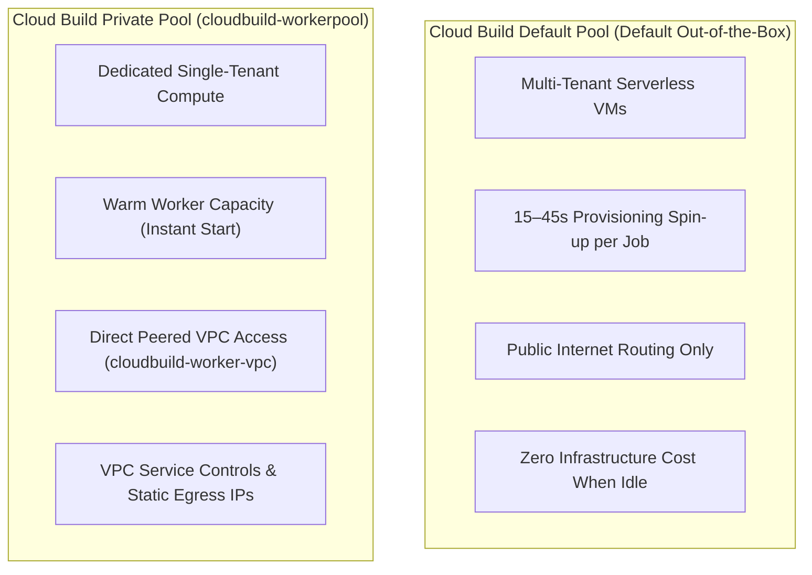

# Architectural Decision Record (ADR): Cloud Deploy Private Worker Pools & Single-Artifact Promotion

> **ADR ID:** ADR-20260902-05  
> **Status:** Accepted  
> **Date:** 2026-09-02  
> **Deciders:** Engineering Lead & Cloud Architecture Team  
> **Scope:** Google Cloud Deploy (`conductor-v3-pipeline`), Cloud Build execution engine, and Cloud Run service manifests

---

## 1. Context and Problem Statement

Operators and engineers inspecting Cloud Build execution history observed new build entries generated at every environment promotion (Dev, Staging, and Production). This raised two core architectural questions:

1. **Build Redundancy**: Does Cloud Deploy recompile code or build new container images per environment? Could a single test-validated build be reused across all promotions?
2. **Execution Worker Architecture**: Why does Cloud Deploy use Cloud Build's default multi-tenant pool by default rather than private pools, and what efficiencies can be unlocked by adopting private worker pools?

In addition, maintaining separate Knative service manifests (`service-v3-dev.yaml`, `service-v3-staging.yaml`, `service-v3.yaml`) introduces configuration drift across deployment tiers.

---

## 2. Decision

We affirm and enforce the **"Build Once, Deploy Everywhere"** architectural standard and standardize our delivery pipeline on **dedicated private worker pools** and **parameterized manifests**:

### 1. Immutable Single-Artifact Promotion
* The application container image is compiled **exactly once** during CI in [`cloudbuild-v3.yaml`](file:///usr/local/google/home/averyn/agentdemos/rficonductorv2/cloudbuild-v3.yaml).
* Google Cloud Deploy locks that immutable Artifact Registry digest (`us-central1-docker.pkg.dev/.../conductor-v3:v3-3-2`) into `buildArtifacts` within the release snapshot.
* Subsequent promotions through Dev, Staging, and Production canary phases reuse the exact same container digest without recompilation.

### 2. Adoption of Dedicated Private Worker Pool (`cloudbuild-workerpool`)
* Configure `executionConfigs` across `dev`, `staging`, and `prod` targets in [`clouddeploy-v3.yaml`](file:///usr/local/google/home/averyn/agentdemos/rficonductorv2/clouddeploy-v3.yaml) to target the private worker pool:
  `projects/riccardo-blog-test-v1/locations/us-central1/workerPools/cloudbuild-workerpool`.
* Reduce execution timeouts from the default `3600s` to `600s` to eliminate prolonged lockouts on failed jobs.

### 3. Manifest Consolidation via Deploy Parameters
* Consolidate environment-specific manifests into a single template: [`infra/cloudrun/service-v3.yaml.template`](file:///usr/local/google/home/averyn/agentdemos/rficonductorv2/infra/cloudrun/service-v3.yaml.template).
* Use Cloud Deploy native `# from-param: ${VAR_NAME}` post-render substitutions for dynamic attributes (`name`, `env`, `maxScale`, `display-name`).
* Declare target-level `deployParameters` in `clouddeploy-v3.yaml`, eliminating file duplication.

---

## 3. Architecture Comparison: Default Pool vs. Private Pool

### Why Cloud Deploy Defaults to the Multi-Tenant Pool
* **Zero-Configuration Baseline**: Most projects do not have private worker pools or VPC peering configured. Defaulting to private pools would cause pipeline setup to fail out-of-the-box.
* **Cost Predictability**: The default pool charges purely per build-second with no reserved infrastructure fees.
* **Open Egress**: Default workers have unrestricted internet access to public image registries and repositories without requiring Cloud NAT.
* **Granular Governance**: Allows organizations to run Dev on low-cost default pools while reserving private pools for compliance-critical Production targets.

---

## 4. Efficiencies and Speed Gains with Private Worker Pools

| Optimization Dimension | Default Multi-Tenant Pool | Dedicated Private Pool (`cloudbuild-workerpool`) | Business & Operational Impact |
| :--- | :--- | :--- | :--- |
| **Worker Spin-up Latency** | +15s to 45s cold start per job | **<2s warm execution start** | Saves **2–4 minutes** across multi-phase canary rollouts. |
| **Internal VPC Connectivity** | Traverses public internet | **Direct VPC peering (`cloudbuild-worker-vpc`)** | Probers can directly query private Cloud Run (`ingress: internal`) and Cloud SQL. |
| **Security & Compliance** | Multi-tenant compute | **Single-tenant dedicated compute** | Full compliance with VPC Service Controls (VPC-SC) perimeters. |
| **Egress Control** | Dynamic Google IP pools | **Deterministic Cloud NAT egress** | Allows static IP allowlisting on partner firewalls and databases. |
| **Disk & I/O Throughput** | Standard temporary disk | **100 GB dedicated SSD storage** | Faster unpack and verification execution. |

---

## 5. Consequences

### Positive Consequences
* **Deterministic Delivery**: Guaranteed byte-for-byte image identity across all promotion stages.
* **Accelerated Delivery Velocity**: Immediate job start times save minutes on every release and canary advance.
* **Enhanced Network Security**: Zero public exposure for internal database queries and verification probes.
* **Clean Configuration**: Single parameterized service template replaces three redundant YAML manifests.

### Tradeoffs & Operational Considerations
* **Infrastructure Dependency**: Cloud Deploy release rendering and rollouts require `cloudbuild-workerpool` to remain in `RUNNING` state.
* **VPC Peering Management**: Target service accounts require appropriate IAM roles (`roles/cloudbuild.workerPoolUser`) on the worker pool resource.
