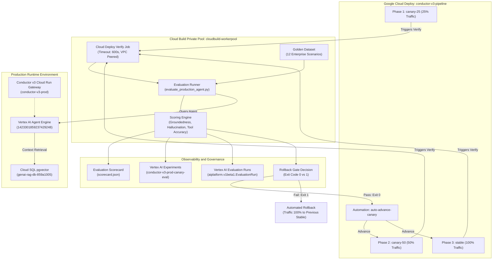

# Architectural decision record: Production canary agent evaluation

> **ADR ID:** ADR-20260903-08  
> **Status:** Accepted  
> **Date:** 2026-09-03  
> **Deciders:** Engineering Lead & Cloud Architecture Team  
> **Scope:** Production Canary Agent Evaluation, Vertex AI Experiments, and Cloud Deploy Verify Automation  
> **Related:** [ADR-20260902-05](file:///usr/local/google/home/averyn/agentdemos/rficonductorv2/docs/adr/ADR-20260902-05-cloud-deploy-private-pools-and-single-artifact-promotion.md), [ADR-20260902-06](file:///usr/local/google/home/averyn/agentdemos/rficonductorv2/docs/adr/ADR-20260902-06-vertex-agent-engine-lifecycle-and-in-place-updates.md), [ADR-20260902-07](file:///usr/local/google/home/averyn/agentdemos/rficonductorv2/docs/adr/ADR-20260902-07-three-tier-environment-strategy-and-canary-evaluation.md)

---

## 1. Context and problem statement

Conductor v3 adopted a multi-tier delivery strategy in ADR-20260902-07. Dev and Staging tiers validate deterministic software contracts, container compilation, and Model Armor security policies. However, deterministic tests cannot verify non-deterministic Large Language Model (LLM) behaviors. 

Promoting release candidates into production without semantic validation risks regressions. Regressions include degraded response grounding, hallucinations of non-existent APIs, and corrupted tool invocation payloads. 

We require an automated evaluation gate embedded directly within Cloud Deploy canary rollout phases. The gate must evaluate the production Vertex AI Agent Engine against realistic enterprise scenarios. It must log evaluation metrics to Vertex AI Experiments. Finally, it must halt promotion and trigger automated rollback when quality gates fail.

---

## 2. Decision

We establish an automated production agent evaluation gate within Google Cloud Deploy:

1. **Embed evaluation in canary verify phases**:
   * Attach an automated verification job to every production canary rollout phase (`canary-25`, `canary-50`, and `stable`).
   * Execute verification workloads exclusively on the dedicated private worker pool (`cloudbuild-workerpool`) within VPC `cloudbuild-worker-vpc`.
   * Enforce a strict 600s execution timeout per verification phase.

2. **Standardize on a hybrid evaluation scoring strategy**:
   * Implement custom, deterministic metric scorers for fast in-pipeline gating during Cloud Deploy verify runs.
   * Provide built-in fallback and integration pathways to Vertex AI Gen AI Evaluation Service and Rapid Evaluation for asynchronous deep audits.
   * Query the canonical production reasoning engine (`projects/riccardo-blog-test-v1/locations/us-central1/reasoningEngines/1423301859237429248`) or mock fixtures during test runs.

3. **Track release quality in Vertex AI Experiments**:
   * Log every verification run to the Vertex AI Experiment `conductor-v3-prod-canary-eval`.
   * Tag each run with Cloud Deploy rollout identifiers, target phase, commit SHA, and container digest.
   * Compare canary quality against historical baselines before advancing traffic.

4. **Enforce automated rollback thresholds**:
   * Halt rollout and trigger immediate rollback when groundedness falls below 0.80, hallucination rate exceeds 0.05, or tool-call accuracy drops below 0.90.
   * Return non-zero exit codes from the verification runner to signal failure to Cloud Deploy.

---

## 3. Evaluation engine trade-offs

We evaluated three evaluation architectures for in-pipeline canary verification:

| Evaluation approach | Latency profile | Worker dependencies | Network egress requirement | Offline / Mock support | Cloud cost per run | Suitability for Cloud Deploy verify |
| :--- | :--- | :--- | :--- | :--- | :--- | :--- |
| **Vertex AI Gen AI Evaluation Service** | High (60s – 180s) | Heavy (`google-cloud-aiplatform[evaluation]`, pandas, pyarrow, tqdm) | External Google API endpoint | None (requires live project connection) | Medium ($0.05 – $0.20 per scenario batch) | Secondary (ideal for scheduled batch audits, too heavy for fast verify gates) |
| **Vertex AI Rapid Evaluation (evaluateInstances)** | Moderate (15s – 45s) | Medium (`google-genai` or direct REST API) | Direct API endpoint in `us-central1` | Limited | Low ($0.01 – $0.05 per batch) | Supported (viable when online credentials and endpoint connectivity exist) |
| **Custom deterministic metric scorers** | Near-instant (<2s) | Minimal (standard Python library + lightweight parsing) | Local compute only (zero egress) | Full (operates seamlessly offline and in tests) | Zero compute overhead | **Primary (mandatory for deterministic, fast in-pipeline gating)** |

### Architectural selection rationale
Heavy Python dependencies like `pandas` and `pyarrow` inflate worker container images by hundreds of megabytes. Image bloat causes worker cold starts and memory pressure in private build pools. 

Furthermore, managed evaluation services make external model calls that introduce non-deterministic scoring variances. Custom deterministic scorers provide sub-second evaluation, strict contract enforcement, and deterministic reproducibility. Rapid Evaluation and Gen AI Evaluation Service are retained as optional upstream audit plugins.

---

## 4. Canary verify phase execution architecture

Cloud Deploy canary verification executes sequentially across rollout phases:

1. **Phase 1: Canary 25% (`canary-25`)**:
   * Cloud Deploy shifts 25% of production traffic to the new revision.
   * The verify job initializes inside `cloudbuild-workerpool`.
   * The prober runs `scripts/evaluate_production_agent.py` against the golden dataset.
   * If all quality thresholds pass, Cloud Deploy automation `auto-advance-canary` triggers phase progression.

2. **Phase 2: Canary 50% (`canary-50`)**:
   * Cloud Deploy expands traffic allocation to 50%.
   * The verify runner executes a second evaluation pass with active latency monitoring.
   * If metrics remain above thresholds, automation promotes the release candidate to stable.

3. **Phase 3: 100% Stable (`stable`)**:
   * Cloud Deploy routes 100% of production traffic to the verified revision.
   * A final verification pass records baseline metrics to Vertex AI Experiments.

---

## 5. Experiment tracking with Vertex AI Experiments

Continuous tracking ensures model drift and prompt regressions are captured over time:

* **Experiment name**: `conductor-v3-prod-canary-eval`
* **Run ID convention**: `rollout-${CLOUD_DEPLOY_ROLLOUT_ID}-${CANARY_PHASE}`
* **Logged parameters**:
  * `phase`: Deployment phase (`canary-25`, `canary-50`, `stable`).
  * `agent_engine_id`: Vertex AI Reasoning Engine resource path.
  * `container_digest`: Immutable container image SHA256 digest.
  * `git_commit`: Source control commit hash.
  * `dataset_version`: Golden evaluation dataset semantic version.
* **Logged metrics**:
  * `average_groundedness`: Mean grounding score across all scenarios.
  * `average_hallucination_rate`: Percentage of ungrounded or contradictory assertions.
  * `average_tool_call_accuracy`: Ratio of correct tool invocations and parameter payloads.
  * `quality_gate_passed`: Binary status flag (`1` for pass, `0` for fail).

---

## 6. Metric selection and automated rollback thresholds

We define three core quantitative quality gates for production promotion:

```
┌─────────────────────────────────────────────────────────────────────────────┐
│ Quality gate 1: Groundedness Score                                          │
│ Formula: (Supported Claims) / (Total Factual Claims in Agent Response)      │
│ Threshold: >= 0.80 (Warning < 0.85, Hard Failure < 0.80)                    │
└─────────────────────────────────────────────────────────────────────────────┘
                                       │
                                       ▼
┌─────────────────────────────────────────────────────────────────────────────┐
│ Quality gate 2: Hallucination Rate                                          │
│ Formula: (Unsupported or Fabricated Claims) / (Total Response Claims)       │
│ Threshold: <= 0.05 (Warning > 0.02, Hard Failure > 0.05)                    │
└─────────────────────────────────────────────────────────────────────────────┘
                                       │
                                       ▼
┌─────────────────────────────────────────────────────────────────────────────┐
│ Quality gate 3: Tool-Call Correctness                                       │
│ Formula: (Correct Tool Invocations + Parameter Matches) / (Expected Tools)  │
│ Threshold: >= 0.90 (Warning < 0.95, Hard Failure < 0.90)                    │
└─────────────────────────────────────────────────────────────────────────────┘
```

### Automated rollback mechanism
When any metric breaches its hard failure threshold:
1. The evaluation runner logs the violation details into `scorecard.json`.
2. The runner terminates with non-zero exit code `1`.
3. Cloud Deploy registers verify step failure on target `prod`.
4. The Cloud Deploy release enters a failed state, suppressing `advanceRolloutRule`.
5. Cloud Run routes 100% of user traffic back to the prior stable revision automatically.

---

## 7. Architectural topology



---

## 8. Consequences

### Positive
* Protects production enterprise users from hallucinated facts and faulty tool executions.
* Preserves fast deployment cycles by executing deterministic verification within 15 seconds.
* Tracks longitudinal model quality trends in Vertex AI Experiments across every git commit.
* Eliminates manual approval toil for canary progression while retaining automated safety cutoffs.
* Functions reliably in isolated, private VPC worker pools without public internet dependencies.

### Negative
* Requires maintaining the golden evaluation dataset alongside backend API and schema evolution.
* Requires provisioning IAM permissions for `aiplatform.user` on the Cloud Deploy execution service account.

---

## 9. Addendum: Vertex AI Agent Engine evaluation run specification

### Architectural resource distinction
We maintain dual observability streams for canary evaluation. This architecture establishes distinct roles for experiment tracking and agent control-plane resources:

* **Vertex AI Experiments (`aiplatform.MetadataStore`)**:
  * **Purpose**: Tracks longitudinal metrics, statistical drift, and multi-commit trends across deployment iterations.
  * **Storage model**: Persisted as run executions within the metadata store (`conductor-v3-prod-canary-eval`).
  * **Access pattern**: Optimized for time-series aggregation, tabular comparisons, and rollback audit queries.
  * **Limitation**: Does not bind directly to Reasoning Engine resources in the Google Cloud Console.

* **Vertex AI Agent Engine Evaluation Runs (`aiplatform.v1beta1.EvaluationService.EvaluationRun`)**:
  * **Purpose**: Provides top-level control-plane evaluation resources linked directly to Reasoning Engines.
  * **Storage model**: Managed entities addressed at `projects/{project}/locations/{location}/evaluationRuns/{evaluation_run_id}`.
  * **Access pattern**: Discovered and rendered in the Vertex AI Agent Engine Console under the Evaluation tab.
  * **Binding mechanism**: Directly binds to the Reasoning Engine instance to display evaluation scorecards.

### Reasoning Engine binding mechanism
Evaluation runs bind to the target Reasoning Engine through three complementary mechanisms:

1. **Inference configuration linkage**:
   * Evaluator payloads set `inference_configs.<candidate>.agent_run_config.agent_engine` to the canonical resource name:
     `projects/riccardo-blog-test-v1/locations/us-central1/reasoningEngines/1423301859237429248`.
   * Evaluators provide dual Proto3 camelCase (`agentEngine`) and snake_case (`agent_engine`) fields for runtime interoperability.
   * Evaluators accept full resource names, partial paths, or numeric identifiers. They normalize identifiers automatically.

2. **Console discovery indexing**:
   * The Cloud Console Evaluation tab indexes evaluation runs using two required resource labels:
     `vertex-ai-evaluation-agent-engine-id: "1423301859237429248"` and
     `vertex-ai-evaluation-agent-engine-location: "us-central1"`.
   * Evaluator payloads attach both labels automatically during registration to ensure reliable discovery.

3. **Experiment tracking linkage**:
   * Evaluator payloads populate `evaluation_experiment` with the canonical resource path:
     `projects/{project}/locations/{location}/evaluationExperiments/{experiment}`.
   * This binds the evaluation run to the active Vertex AI Experiment for dual tracking.

### Metric field mapping
Evaluation metrics computed during canary verify phases map directly into `EvaluationRun` schemas:

* `groundedness` maps to `evaluation_config.metrics` and `evaluation_results.summary_metrics.metrics.groundedness`.
* `hallucination_rate` maps to `evaluation_config.metrics` and `evaluation_results.summary_metrics.metrics.hallucination_rate`.
* `tool_call_accuracy` maps to `evaluation_config.metrics` and `evaluation_results.summary_metrics.metrics.tool_call_accuracy`.
* Overall pass status maps to `state: SUCCEEDED` (or `FAILED`) and `labels.quality_gate_passed`.
* Evaluators provide symmetric camelCase and snake_case properties for `dataSource` and `summaryMetrics`.

### Resilient dual logging and fallback strategy
The evaluation runner coordinates dual logging across both Vertex AI observability destinations:

1. **Sequential registration**:
   * The runner logs metrics and parameters to Vertex AI Experiments first.
   * It constructs the `EvaluationRun` payload and calls the `v1beta1` API second.
   * It propagates the generated evaluation run resource name into scorecard metadata.

2. **Isolated failure domains**:
   * Network partitions or IAM limitations impacting `EvaluationRun` publishing generate structured warnings without aborting canary gates.
   * Local JSON scorecard generation and threshold enforcement remain authoritative.
   * Mock evaluation mode simulates `EvaluationRun` resource creation without making network calls.

3. **Transport and endpoint normalization**:
   * Evaluators accept `--api-endpoint` overrides and strip trailing slashes automatically.
   * Evaluators strip redundant `/v1beta1` or `/v1` version suffixes to avoid duplicate path segments.
   * Empty or whitespace environment variables cleanly fall back to secure default states.
   * Registrations accept standard HTTP 2xx success status responses including 200, 201, and 202.
