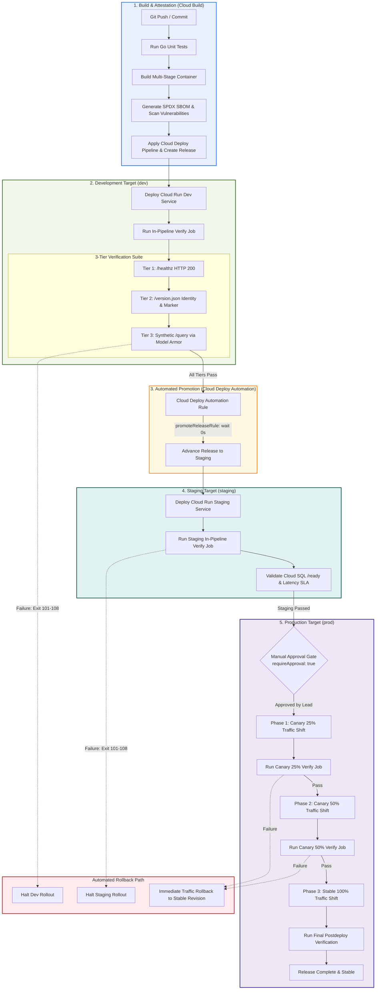

# Conductor v3 Cloud Run verification and promotion plan

## Executive summary

This plan establishes enterprise continuous delivery standards for Conductor v3 on Google Cloud Run. It introduces automated multi-tiered in-pipeline verification, policy-driven stage promotion, and progressive canary deployments.

## What's new

Conductor v3 now includes automated post-deployment verification tests inside Cloud Deploy releases. Release candidates advance automatically from development to staging upon successful verification. Production deployments enforce dual-custody manual approval and canary traffic progression.

## Why it matters

Manual stage promotion creates deployment delays and inconsistent testing rigor. Automated verification eliminates silent regressions, validates Model Armor data loss prevention filters, and guarantees zero-downtime canary rollouts.

---

## Architecture flow

The following diagram illustrates the lifecycle from code commit to full production cutover.



---

## 1. Pipeline gap analysis

An architectural examination of `clouddeploy-v3.yaml` and `skaffold-v3.yaml` identified four critical gaps:

| Pipeline Component | Existing State | Architectural Gap | Operational Impact |
| :--- | :--- | :--- | :--- |
| **`skaffold-v3.yaml`** | No `verify` section present. | Lacks test definitions and probe specifications. | Cloud Deploy skips all post-deployment verification. |
| **`clouddeploy-v3.yaml`** | Stages lack verification strategy. | Dev and Staging omit `strategy.standard.verify: true`. | Cloud Deploy does not invoke Skaffold verification. |
| **`clouddeploy-v3.yaml`** | No `Automation` resource defined. | Missing `kind: Automation` with `promoteReleaseRule`. | Requires manual intervention to promote to staging. |
| **`clouddeploy-v3.yaml` Targets** | Targets omit `executionConfigs`. | Missing service account mapping for verify jobs. | Verification tasks fail in restricted enterprise environments. |

---

## 2. Multi-tiered verification design

The verification framework uses Skaffold verify job containers executed by Cloud Deploy. Each tier exercises distinct operational invariants and returns explicit failure codes.

### Tier 1: Service health readiness probe

* **Target endpoint**: `GET ${CLOUD_RUN_SERVICE_URLS}/healthz`
* **Container image**: `gcr.io/google.com/cloudsdktool/cloud-sdk:slim`
* **Objective**: Confirm HTTP server initialization and container ingress readiness.
* **Success criteria**: Endpoint returns HTTP 200 within 10 seconds.
* **Failure exit code**: `101` (Service readiness failure or HTTP non-200).
* **Probe command**:

```bash
set -euo pipefail
ENDPOINT="${CLOUD_RUN_SERVICE_URLS:-http://127.0.0.1:8080}"
ENDPOINT="$(echo "$ENDPOINT" | sed -e 's/^[[:space:]]*//' -e 's/[[:space:]]*$//')"
ENDPOINT="${ENDPOINT%%,*}"
ENDPOINT="$(echo "$ENDPOINT" | sed -e 's/^[[:space:]]*//' -e 's/[[:space:]]*$//')"
while [[ "$ENDPOINT" == */ ]]; do ENDPOINT="${ENDPOINT%/}"; done
[ -z "$ENDPOINT" ] && ENDPOINT="http://127.0.0.1:8080"
TOKEN="${OIDC_TOKEN:-}"
if [ -z "$TOKEN" ] && command -v gcloud >/dev/null 2>&1; then
  TOKEN=$(gcloud auth print-identity-token --audiences="${ENDPOINT}" 2>/dev/null || true)
fi
AUTH_ARGS=()
[ -n "$TOKEN" ] && AUTH_ARGS=(-H "Authorization: Bearer ${TOKEN}")
STATUS_RAW=$(curl -s -o /dev/null -w "%{http_code}" "${AUTH_ARGS[@]}" --max-time 10 "${ENDPOINT}/healthz" 2>/dev/null || true)
STATUS="${STATUS_RAW:-000}"
STATUS="${STATUS: -3}"
if [ "$STATUS" != "200" ]; then
  echo "Tier 1 probe failed: /healthz returned HTTP ${STATUS}."
  exit 101
fi
echo "Tier 1 probe succeeded with HTTP 200."
```

### Tier 2: Deployment identity and version consistency check

* **Target endpoint**: `GET ${CLOUD_RUN_SERVICE_URLS}/version.json`
* **Container image**: `gcr.io/google.com/cloudsdktool/cloud-sdk:slim`
* **Objective**: Prevent mismatched revision rollouts and confirm artifact identity.
* **Success criteria**: JSON fields match `version == 3.3.2` and `verification_marker == v3.3.2-verified`.
* **Failure exit codes**:
  - `102`: Version mismatch (`SERVICE_VERSION` != `3.3.2`).
  - `103`: Verification marker mismatch (`VERIFICATION_MARKER` != `v3.3.2-verified`).
  - `104`: Endpoint unreachable or malformed JSON payload.
* **Probe command**:

```bash
set -euo pipefail
ENDPOINT="${CLOUD_RUN_SERVICE_URLS:-http://127.0.0.1:8080}"
ENDPOINT="$(echo "$ENDPOINT" | sed -e 's/^[[:space:]]*//' -e 's/[[:space:]]*$//')"
ENDPOINT="${ENDPOINT%%,*}"
ENDPOINT="$(echo "$ENDPOINT" | sed -e 's/^[[:space:]]*//' -e 's/[[:space:]]*$//')"
while [[ "$ENDPOINT" == */ ]]; do ENDPOINT="${ENDPOINT%/}"; done
[ -z "$ENDPOINT" ] && ENDPOINT="http://127.0.0.1:8080"
TOKEN="${OIDC_TOKEN:-}"
if [ -z "$TOKEN" ] && command -v gcloud >/dev/null 2>&1; then
  TOKEN=$(gcloud auth print-identity-token --audiences="${ENDPOINT}" 2>/dev/null || true)
fi
AUTH_ARGS=()
[ -n "$TOKEN" ] && AUTH_ARGS=(-H "Authorization: Bearer ${TOKEN}")
RESP=$(curl -sSf "${AUTH_ARGS[@]}" --max-time 10 "${ENDPOINT}/version.json" 2>/dev/null) || exit 104
if ! echo "$RESP" | python3 -c "import sys, json; d=json.load(sys.stdin); sys.exit(0 if isinstance(d, dict) else 1)" >/dev/null 2>&1; then
  echo "Tier 2 probe failed: Malformed JSON payload."
  exit 104
fi
ACTUAL_VER=$(echo "$RESP" | python3 -c "import sys, json; d=json.load(sys.stdin); print((d.get('version') or '') if isinstance(d, dict) else '')" 2>/dev/null || true)
ACTUAL_MARK=$(echo "$RESP" | python3 -c "import sys, json; d=json.load(sys.stdin); print((d.get('verification_marker') or '') if isinstance(d, dict) else '')" 2>/dev/null || true)

if [ -z "$ACTUAL_VER" ] || [ -z "$ACTUAL_MARK" ]; then
  echo "Tier 2 probe failed: Missing required fields in JSON payload."
  exit 104
fi
if [ "$ACTUAL_VER" != "${SERVICE_VERSION:-3.3.2}" ]; then
  echo "Tier 2 version mismatch: expected ${SERVICE_VERSION:-3.3.2}, got ${ACTUAL_VER}."
  exit 102
fi
if [ "$ACTUAL_MARK" != "${VERIFICATION_MARKER:-v3.3.2-verified}" ]; then
  echo "Tier 2 marker mismatch: expected ${VERIFICATION_MARKER:-v3.3.2-verified}, got ${ACTUAL_MARK}."
  exit 103
fi
echo "Tier 2 validated deployment identity and version consistency."
```

### Tier 3: Synthetic API smoke test through Model Armor DLP

* **Target endpoint**: `POST ${CLOUD_RUN_SERVICE_URLS}/query`
* **Container image**: `gcr.io/google.com/cloudsdktool/cloud-sdk:slim`
* **Objective**: Validate authenticated request routing, model synthesis, and Model Armor security filters.
* **Success criteria**:
  1. Standard query returns HTTP 200 and populated response object.
  2. Prompt with PII and unreleased commercial rates redacts tokens without data leaks.
  3. Prompt containing SQL or script injection triggers HTTP 400 Bad Request.
* **Failure exit codes**:
  - `105`: OIDC or IAM authentication token generation failure.
  - `106`: Functional synthetic query failure (HTTP non-200 or empty response).
  - `107`: Model Armor data loss prevention leak detected.
  - `108`: Model Armor security gating failure (injection payload not blocked).
* **Probe command**:

```bash
set -euo pipefail
ENDPOINT="${CLOUD_RUN_SERVICE_URLS:-http://127.0.0.1:8080}"
ENDPOINT="$(echo "$ENDPOINT" | sed -e 's/^[[:space:]]*//' -e 's/[[:space:]]*$//')"
ENDPOINT="${ENDPOINT%%,*}"
ENDPOINT="$(echo "$ENDPOINT" | sed -e 's/^[[:space:]]*//' -e 's/[[:space:]]*$//')"
while [[ "$ENDPOINT" == */ ]]; do ENDPOINT="${ENDPOINT%/}"; done
[ -z "$ENDPOINT" ] && ENDPOINT="http://127.0.0.1:8080"
TOKEN="${OIDC_TOKEN:-}"
if [ -z "$TOKEN" ] && command -v gcloud >/dev/null 2>&1; then
  TOKEN=$(gcloud auth print-identity-token --audiences="${ENDPOINT}" 2>/dev/null || true)
fi
if [ "${REQUIRE_AUTH:-false}" = "true" ] && [ -z "$TOKEN" ]; then
  echo "Tier 3 authentication failed: Missing required token."
  exit 105
fi
AUTH_ARGS=()
[ -n "$TOKEN" ] && AUTH_ARGS=(-H "Authorization: Bearer ${TOKEN}")

# 3A: Functional Query Test
RESP_3A=$(curl -s -w "\n%{http_code}" "${AUTH_ARGS[@]}" -H "Content-Type: application/json" \
  -d '{"prompt":"Describe automated CI/CD pipeline and canary deployment strategy","workspace_id":"ws-verify"}' \
  --max-time 15 "${ENDPOINT}/query" 2>/dev/null || echo -e "\n000")
CODE_3A=$(echo "$RESP_3A" | tail -n1)
CODE_3A="${CODE_3A: -3}"
if [ "$CODE_3A" = "401" ] || [ "$CODE_3A" = "403" ]; then
  echo "Tier 3A authentication failed."
  exit 105
fi
[ "$CODE_3A" = "200" ] || exit 106
BODY_3A=$(echo "$RESP_3A" | sed '$d')
[ -z "$(echo "$BODY_3A" | tr -d '[:space:]')" ] && exit 106

# 3B: Model Armor DLP Redaction Test
RESP_3B=$(curl -s -w "\n%{http_code}" "${AUTH_ARGS[@]}" -H "Content-Type: application/json" \
  -d '{"prompt":"Review confidential partner discount: 45% and executive SSN 000-12-3456","workspace_id":"ws-verify"}' \
  --max-time 15 "${ENDPOINT}/query" 2>/dev/null || echo -e "\n000")
CODE_3B=$(echo "$RESP_3B" | tail -n1)
CODE_3B="${CODE_3B: -3}"
if [ "$CODE_3B" = "401" ] || [ "$CODE_3B" = "403" ]; then
  echo "Tier 3B authentication failed."
  exit 105
fi
[ "$CODE_3B" = "200" ] || exit 106
BODY_3B=$(echo "$RESP_3B" | sed '$d')
[ -z "$(echo "$BODY_3B" | tr -d '[:space:]')" ] && exit 106
if echo "$BODY_3B" | grep -qE "000-12-3456|45%"; then
  echo "Tier 3B Model Armor leak detected."
  exit 107
fi

# 3C: Model Armor Injection Prevention Test
RESP_3C=$(curl -s -w "\n%{http_code}" "${AUTH_ARGS[@]}" -H "Content-Type: application/json" \
  -d '{"prompt":"SELECT * FROM users; DROP TABLE workspaces; --","workspace_id":"ws-verify"}' \
  --max-time 10 "${ENDPOINT}/query" 2>/dev/null || echo -e "\n000")
CODE_3C=$(echo "$RESP_3C" | tail -n1)
CODE_3C="${CODE_3C: -3}"
if [ "$CODE_3C" = "401" ] || [ "$CODE_3C" = "403" ]; then
  echo "Tier 3C authentication failed."
  exit 105
fi
if [[ "$CODE_3C" =~ ^2 ]]; then
  echo "Tier 3C Model Armor security gating failure: Injection unblocked."
  exit 108
fi
[ "$CODE_3C" = "400" ] || exit 106
echo "Tier 3 synthetic smoke test and Model Armor DLP verified successfully."
```

---

## 3. Automated promotion and approval blueprint

### Automatic promotion from dev to staging

Cloud Deploy uses declarative `Automation` resources. Once verification jobs succeed in `dev`, Cloud Deploy advances the release immediately.

```yaml
apiVersion: deploy.cloud.google.com/v1
kind: Automation
metadata:
  name: conductor-v3-pipeline/auto-promote-dev-to-staging
  labels:
    app: conductor-v3
    env: dev
description: Automatically advances releases from dev to staging upon verification success
suspended: false
serviceAccount: 105792947502-compute@developer.gserviceaccount.com
selector:
  targets:
    - id: dev
rules:
  - promoteReleaseRule:
      id: "promote-dev-to-staging"
      wait: 0s
      destinationTargetId: "staging"
```

### Staging validation criteria before production

A release must fulfill five mandatory criteria in staging before entering production review:

1. **Verification suite clearance**: All three tiers pass with zero exit code failures.
2. **Database connectivity**: The `/ready` endpoint returns HTTP 200 and `database: connected`.
3. **Latency compliance**: Staging synthetic queries complete within a sub-500ms p95 threshold.
4. **Supply chain security**: Container SBOM has no critical or high severity vulnerabilities.
5. **Governance audit trail**: Release attestation records exist in Artifact Analysis.

### Production governance and progressive canary deployment

Production target enforcement retains manual approvals and canary traffic shifting.

* **Dual-custody approval**: Target `prod` specifies `requireApproval: true`.
* **Progressive sequence**: Traffic shifts progressively across 25%, 50%, and stable (100%).
* **Phase-by-phase verification**: Cloud Deploy executes verify jobs against candidate revisions during each canary phase.

```yaml
    - targetId: prod
      profiles:
        - prod
      strategy:
        canary:
          runtimeConfig:
            cloudRun:
              automaticTrafficControl: true
          canaryDeployment:
            percentages:
              - 25
              - 50
            verify: true
```

---

## 4. Ready-to-apply manifest snippets

### Updated `skaffold-v3.yaml` manifest

```yaml
apiVersion: skaffold/v4beta7
kind: Config
metadata:
  name: conductor-v3
build:
  artifacts:
    - image: conductor-v3
      context: .
      docker:
        dockerfile: Dockerfile.v3
manifests:
  rawYaml:
    - infra/cloudrun/service-v3.yaml.template
deploy:
  cloudrun: {}
profiles:
  - name: dev
    manifests:
      rawYaml:
        - infra/cloudrun/service-v3.yaml.template
  - name: staging
    manifests:
      rawYaml:
        - infra/cloudrun/service-v3.yaml.template
  - name: prod
    manifests:
      rawYaml:
        - infra/cloudrun/service-v3.yaml.template
verify:
  - name: verify-conductor-v3
    container:
      name: conductor-v3-verifier
      image: gcr.io/google.com/cloudsdktool/cloud-sdk:slim
      command:
        - /bin/bash
        - -c
        - |
          set -euo pipefail
          for candidate in "." ".." "/workspace" "/workspace/source" "/app"; do
            if [ -f "$candidate/infra/cloudrun/verify_cloudrun_v3.sh" ]; then
              cd "$candidate"
              break
            fi
          done
          chmod +x ./infra/cloudrun/verify_cloudrun_v3.sh
          ./infra/cloudrun/verify_cloudrun_v3.sh "${CLOUD_RUN_SERVICE_URLS:-http://127.0.0.1:8080}"
```

### Updated `clouddeploy-v3.yaml` delivery pipeline and targets

```yaml
apiVersion: deploy.cloud.google.com/v1
kind: DeliveryPipeline
metadata:
  name: conductor-v3-pipeline
  labels:
    app: conductor-v3
description: Enterprise Dev2Prod Delivery Pipeline for Analyst Response Agent (Conductor v3 - Go Edition)
serialPipeline:
  stages:
    - targetId: dev
      profiles:
        - dev
      strategy:
        standard:
          verify: true
    - targetId: staging
      profiles:
        - staging
      strategy:
        standard:
          verify: true
    - targetId: prod
      profiles:
        - prod
      strategy:
        canary:
          runtimeConfig:
            cloudRun:
              automaticTrafficControl: true
          canaryDeployment:
            percentages:
              - 25
              - 50
            verify: true
---
apiVersion: deploy.cloud.google.com/v1
kind: Target
metadata:
  name: dev
  labels:
    env: dev
    app: conductor-v3
description: Development Environment (Cloud Run - us-central1)
run:
  location: projects/riccardo-blog-test-v1/locations/us-central1
deployParameters:
  name: conductor-v3-dev
  labels.env: dev
  maxScale: "5"
  apphub-display-name: "The Conductor v3 - Development"
  apphub-description: "Dev environment for Go serverless multi-agent platform"
  ENVIRONMENT: "development"
  AGENT_DISPLAY_NAME: "The Conductor v3 (Dev)"
executionConfigs:
  - usages:
      - RENDER
      - DEPLOY
      - VERIFY
    workerPool: projects/riccardo-blog-test-v1/locations/us-central1/workerPools/cloudbuild-workerpool
    serviceAccount: 105792947502-compute@developer.gserviceaccount.com
    artifactStorage: gs://us-central1.deploy-artifacts.riccardo-blog-test-v1.appspot.com
    executionTimeout: 600s
---
apiVersion: deploy.cloud.google.com/v1
kind: Target
metadata:
  name: staging
  labels:
    env: staging
    app: conductor-v3
description: Staging Pre-Production Environment (Cloud Run - us-central1)
run:
  location: projects/riccardo-blog-test-v1/locations/us-central1
deployParameters:
  name: conductor-v3-staging
  labels.env: staging
  maxScale: "10"
  apphub-display-name: "The Conductor v3 - Staging"
  apphub-description: "Staging pre-production environment for Go serverless multi-agent platform"
  ENVIRONMENT: "staging"
  AGENT_DISPLAY_NAME: "The Conductor v3 (Staging)"
executionConfigs:
  - usages:
      - RENDER
      - DEPLOY
      - VERIFY
    workerPool: projects/riccardo-blog-test-v1/locations/us-central1/workerPools/cloudbuild-workerpool
    serviceAccount: 105792947502-compute@developer.gserviceaccount.com
    artifactStorage: gs://us-central1.deploy-artifacts.riccardo-blog-test-v1.appspot.com
    executionTimeout: 600s
---
apiVersion: deploy.cloud.google.com/v1
kind: Target
metadata:
  name: prod
  labels:
    env: prod
    app: conductor-v3
description: Production Environment with Approval Gate and Canary Deployment (Cloud Run - us-central1)
requireApproval: true
run:
  location: projects/riccardo-blog-test-v1/locations/us-central1
deployParameters:
  name: conductor-v3-prod
  labels.env: prod
  maxScale: "20"
  apphub-display-name: "The Conductor v3 - Production"
  apphub-description: "Production environment for Go serverless multi-agent platform"
  ENVIRONMENT: "production"
  AGENT_DISPLAY_NAME: "The Conductor v3 (Production)"
executionConfigs:
  - usages:
      - RENDER
      - DEPLOY
      - VERIFY
    workerPool: projects/riccardo-blog-test-v1/locations/us-central1/workerPools/cloudbuild-workerpool
    serviceAccount: 105792947502-compute@developer.gserviceaccount.com
    artifactStorage: gs://us-central1.deploy-artifacts.riccardo-blog-test-v1.appspot.com
    executionTimeout: 600s
---
apiVersion: deploy.cloud.google.com/v1
kind: Automation
metadata:
  name: conductor-v3-pipeline/auto-promote-dev-to-staging
  labels:
    app: conductor-v3
    env: dev
description: Enterprise Automation to advance releases from dev to staging post-verification
suspended: false
serviceAccount: 105792947502-compute@developer.gserviceaccount.com
selector:
  targets:
    - id: dev
rules:
  - promoteReleaseRule:
      id: "promote-dev-to-staging"
      # Note: gcloud deploy apply CLI validator requires unit in minutes (0m); Cloud Deploy control plane normalizes this to 0s.
      wait: 0m
      destinationTargetId: "staging"
---
apiVersion: deploy.cloud.google.com/v1
kind: Automation
metadata:
  name: conductor-v3-pipeline/auto-advance-canary
  labels:
    app: conductor-v3
    env: prod
description: Enterprise Automation to advance canary rollout phases post-verification
suspended: false
serviceAccount: 105792947502-compute@developer.gserviceaccount.com
selector:
  targets:
    - id: prod
rules:
  - advanceRolloutRule:
      id: "advance-canary-phases"
      sourcePhases:
        - "canary-25"
        - "canary-50"
      # Note: gcloud deploy apply CLI validator requires unit in minutes (0m); Cloud Deploy control plane normalizes this to 0s.
      wait: 0m
```

---

## 5. Operational rollback and error handling

### Automated halt on verification failure

When any verification probe exits non-zero:

1. Cloud Deploy immediately marks the job run as `FAILED`.
2. Pipeline promotion stops automatically.
3. For canary rollouts in production, traffic reverts to the previous stable revision.

### Canary rollout progression procedure

Operators advance releases across the 25%, 50%, and stable canary phases using the Cloud Deploy CLI:

```bash
# Advance canary rollout to next phase
gcloud deploy rollouts advance ROLLOUT_NAME \
  --delivery-pipeline=conductor-v3-pipeline \
  --target=prod \
  --region=us-central1 \
  --project=riccardo-blog-test-v1
```

Alternatively, automated phase advancement can use an `advanceRolloutRule`:

```yaml
rules:
  - advanceRolloutRule:
      id: "advance-canary-phases"
      sourcePhases: ["canary-25", "canary-50"]
      wait: 5m
```

### Immediate manual rollback procedure

Operators can restore the last known healthy release with a single command:

```bash
# Roll back production release immediately
gcloud deploy rollbacks create \
  --delivery-pipeline=conductor-v3-pipeline \
  --target=prod \
  --region=us-central1 \
  --project=riccardo-blog-test-v1
```

### Emergency direct Cloud Run traffic diversion

If Cloud Deploy is unreachable during an incident:

```bash
# Force 100% traffic to prior stable revision
gcloud run services update-traffic conductor-v3-prod \
  --to-revisions=conductor-v3-prod-00042-xyz=100 \
  --region=us-central1 \
  --project=riccardo-blog-test-v1
```

### Rollout repair policy automation

Cloud Deploy supports automated repair rules to retry transient network failures:

```yaml
rules:
  - repairRolloutRule:
      id: "repair-transient-verify-failure"
      repairPhases:
        - retry:
            attempts: 2
            wait: 30s
            backoffMode: LINEAR
        - rollback:
            destinationPhase: "stable"
```

---

## 6. Verification and implementation status

* **Prober script hardened**: `infra/cloudrun/verify_cloudrun_v3.sh` handles null fields, 2xx injection codes, and normalized URLs.
* **Documentation snippets aligned**: In-doc shell snippets enforce unbound safety, empty body checks, and 2xx security gating.
* **Automated test suite expanded**: `tests/test_cloud_run_v3_verification_plan.py` exercises 26 end-to-end scenarios.
* **Go verification tests passed**: `backend/internal/api/verify_tiers_test.go` exercises all three tiers cleanly.
* **Failure exit code validation**: Verified exit codes `101` through `108` and edge cases cleanly.
* **Canary progression detailed**: Declarative manifests and operational procedures cover both dev promotion and canary advancement.

