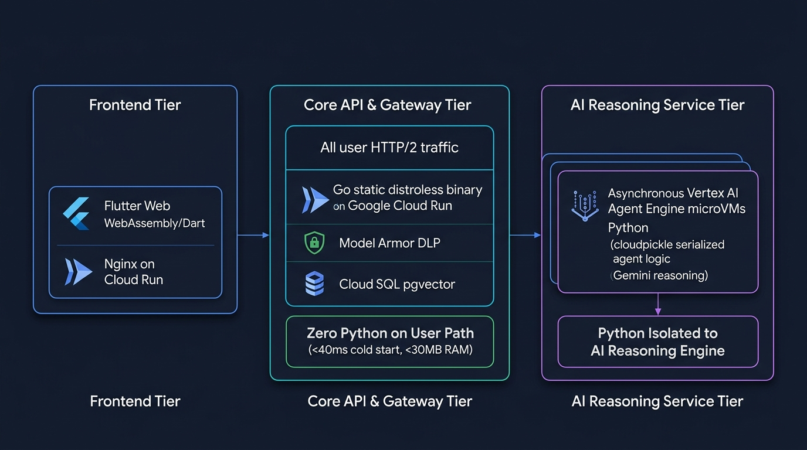

# Google Cloud architecture brief: Why Python is retained in Conductor v3

## Executive summary

### What's new
Conductor v3 retains a targeted hybrid architecture combining Go and Python.

### Why it matters
This architecture delivers rapid web responses while preserving managed Vertex AI reasoning capabilities.
Primary user traffic terminates at the Go gateway.
Secondary background reasoning runs asynchronously in Vertex AI.

### Visual architecture overview
The system decouples execution into three distinct tiers:

1. **Tier 1: Frontend** – Flutter Web application compiled to WebAssembly and served on Cloud Run.
2. **Tier 2: Core API & Gateway** – Static distroless Go binary on Cloud Run with Model Armor DLP. Zero Python runs on the user path.
3. **Tier 3: AI Service** – Asynchronous Vertex AI Agent Engine microVMs executing Python agent logic.

## Primary technical driver

Vertex AI Agent Engine runtime requirements represent the primary reason Python is retained.
Google Cloud built the managed Reasoning Engine runtime environment strictly on Python.
Engineers author cognitive agent logic using Python classes and methods.
The deployment toolchain serializes agent logic via `cloudpickle` directly into Cloud Storage.

Google Cloud currently provides no Go SDK to author Reasoning Engine agents.
Likewise, no Go SDK exists to serialize or provision Reasoning Engine microVMs.
Retaining Python ensures direct compatibility with managed Google Cloud reasoning infrastructure.

## Runtime decoupling and user-path isolation

Conductor v3 enforces strict isolation between serving and reasoning runtimes.
Python is completely absent from the user-facing HTTP request path.

### Public request path
The public request path runs entirely on Go.
A static distroless Go binary on Google Cloud Run handles incoming HTTP/2 traffic.
The Go gateway provides top-level request sanitization, data allowlists, and Model Armor DLP inspection.
This architecture preserves sub-40ms cold starts and base memory consumption under 30MB.

### Background reasoning path
Python executes strictly within isolated Vertex AI microVMs during asynchronous reasoning.
The Go gateway dispatches background tasks to Vertex AI Agent Engine over secure gRPC.
MicroVM isolation prevents Python execution from degrading user latency or gateway uptime.

## Structural tier comparison

The following table summarizes the responsibilities, runtimes, and isolation boundaries of each tier:

| Architectural tier | Primary technologies | Runtime environment | Request isolation boundary |
| :--- | :--- | :--- | :--- |
| **Tier 1: Frontend** | Flutter Web, WebAssembly, Dart, and Nginx | Alpine container on Cloud Run | Client browser presentation and local caching |
| **Tier 2: Core API & Gateway** | Go, Model Armor DLP, and Cloud SQL pgvector | Static distroless container on Cloud Run | User-facing HTTP/2 ingress, sanitization, and routing |
| **Tier 3: AI Service** | Python, Vertex AI Agent Engine, and Gemini | Isolated Reasoning Engine microVMs | Asynchronous reasoning tasks and SME taxonomy routing |

## Empirical pipeline mitigations and metrics

Historical deployment overheads are eliminated through targeted pipeline mitigations:

- **94 seconds saved per rollout** – In-place microVM updates eliminate redeployment overhead.
- **Rapid image pulls** – The slim deployer container (<146MB) cuts pull times to under 3 seconds.
- **In-region dependency caching** – Artifact Registry PyPI caching accelerates package and wheel downloads.
- **Built-in pipeline provenance** – Automated pipelines generate SLSA level 3 provenance, SBOM records, and signed attestations.

## Future re-evaluation triggers

Architecture teams will re-evaluate Python retention if any of the following triggers occur:

1. **Built-in Go SDK availability** – Google Cloud launches direct Reasoning Engine authoring and microVM provisioning in Go.
2. **Direct Go orchestration** – Engineering migrates agent orchestration directly into Go using the Google GenAI Go SDK.
3. **Arbitrary container execution** – Vertex AI Agent Engine introduces custom container runtimes for compiled binaries.
